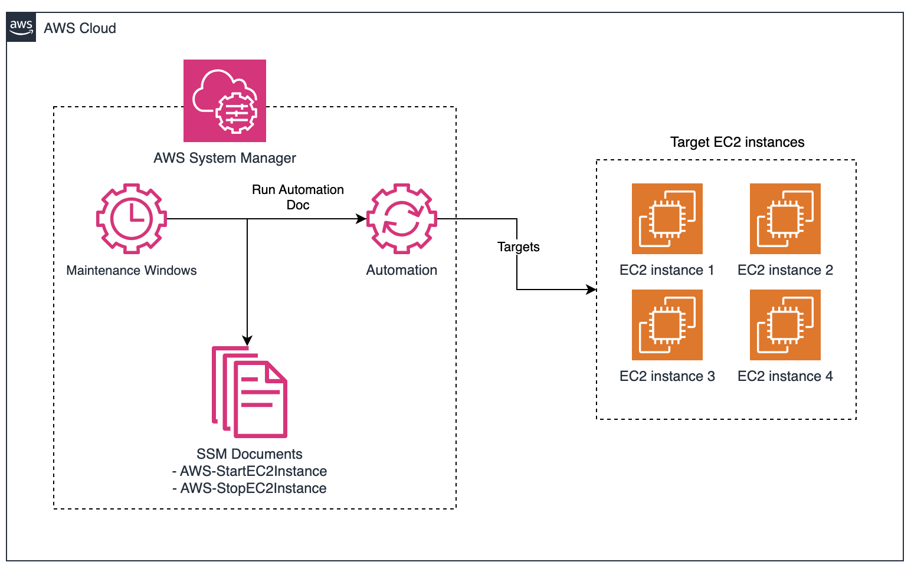

# ec2-start-stop-scheduler

## Architecture

<!-- BEGINNING OF PRE-COMMIT-TERRAFORM DOCS HOOK -->
## Requirements

| Name | Version |
|------|---------|
|  [terraform](#requirement\_terraform) | >= 1.9.0 |
|  [aws](#requirement\_aws) | ~> 5.0 |

## Providers

| Name | Version |
|------|---------|
|  [aws](#provider\_aws) | ~> 5.0 |

## Modules

No modules.

## Resources

| Name | Type |
|------|------|
| [aws_iam_role.ssm](https://registry.terraform.io/providers/hashicorp/aws/latest/docs/resources/iam_role) | resource |
| [aws_iam_role_policy.ssm_ec2_automation](https://registry.terraform.io/providers/hashicorp/aws/latest/docs/resources/iam_role_policy) | resource |
| [aws_iam_role_policy_attachment.ssm_full_access](https://registry.terraform.io/providers/hashicorp/aws/latest/docs/resources/iam_role_policy_attachment) | resource |
| [aws_ssm_maintenance_window.self](https://registry.terraform.io/providers/hashicorp/aws/latest/docs/resources/ssm_maintenance_window) | resource |
| [aws_ssm_maintenance_window_target.self](https://registry.terraform.io/providers/hashicorp/aws/latest/docs/resources/ssm_maintenance_window_target) | resource |
| [aws_ssm_maintenance_window_task.self](https://registry.terraform.io/providers/hashicorp/aws/latest/docs/resources/ssm_maintenance_window_task) | resource |
| [aws_iam_policy_document.ec2_automation](https://registry.terraform.io/providers/hashicorp/aws/latest/docs/data-sources/iam_policy_document) | data source |
| [aws_ssm_document.start_ec2](https://registry.terraform.io/providers/hashicorp/aws/latest/docs/data-sources/ssm_document) | data source |
| [aws_ssm_document.stop_ec2](https://registry.terraform.io/providers/hashicorp/aws/latest/docs/data-sources/ssm_document) | data source |

## Inputs

| Name | Description | Type | Default | Required |
|------|-------------|------|---------|:--------:|
|  [schedules](#input\_schedules) | (Required) List of schedules for the SSM Maintenance Window | <pre>list(object({     name                = string     action              = string     schedule            = string     schedule_timezone   = optional(string, "UTC")     target_instance_ids = list(string)     description         = optional(string, "")   }))</pre> | n/a | yes |

## Outputs

| Name | Description |
|------|-------------|
|  [maintenance\_window\_ids](#output\_maintenance\_window\_ids) | List of maintenance window IDs |
<!-- END OF PRE-COMMIT-TERRAFORM DOCS HOOK -->
